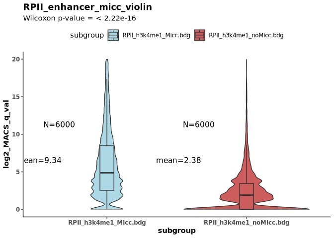

RPII_enhancer_micc_violin
================
<yemingxie@gmail.com>
Thu Aug 21 10:46:38 2025

``` r
knitr::opts_chunk$set(echo = TRUE)

library(ggplot2)
library(ggsci)
library(httpgd)
library(dplyr)
```

    ## 
    ## Attaching package: 'dplyr'

    ## The following objects are masked from 'package:stats':
    ## 
    ##     filter, lag

    ## The following objects are masked from 'package:base':
    ## 
    ##     intersect, setdiff, setequal, union

``` r
library(tidyr)
library(ggsignif)
npg_colors <- pal_npg()(10)

args = commandArgs(trailingOnly=TRUE)
file_path=getwd()

setwd('/research/xieyeming1/proj_2025/MICC_paper/genometube/MICC-seq/figs/enhancer_Micc_noMicc')
plot_title='RPII_enhancer_micc_violin'
y_axis='log2_MACS_q_val'
in_file1='RPII_h3k4me1_Micc.bdg'
in_file2='RPII_h3k4me1_noMicc.bdg'
in_file_1 <- read.table(paste0(file_path,'/',in_file1), sep="\t", header=F)
in_file_1$subgroup<-in_file1
in_file_2 <- read.table(paste0(file_path,'/',in_file2), sep="\t", header=F)
in_file_2$subgroup<-in_file2

# combine all data
in_file_1_<-in_file_1[sample(1:nrow(in_file_1),6000),]
# random sample rows from RPII_enhancer_micc
in_file_2_<-in_file_2[sample(1:nrow(in_file_2),6000),]
# combine all data
all_data <- rbind(in_file_1_, in_file_2_)
# all_data$feature_val <- ifelse(all_data$V4 > 0, log2(all_data$V4), NA)
all_data$feature_val <- all_data$V4
wilcox_result <- wilcox.test(in_file_2$V4, in_file_1$V4, 
                           alternative = "two.sided")
head(all_data)
```

    ##         V1        V2        V3        V4              subgroup feature_val
    ## 6885  chr6 111194749 111195112  2.850000 RPII_h3k4me1_Micc.bdg    2.850000
    ## 4587 chr19  55684955  55685285 29.742308 RPII_h3k4me1_Micc.bdg   29.742308
    ## 2913 chr16  29910046  29910429  2.412500 RPII_h3k4me1_Micc.bdg    2.412500
    ## 4941  chr2 133028235 133028638 52.483562 RPII_h3k4me1_Micc.bdg   52.483562
    ## 7374  chr7 149387386 149387745  3.166667 RPII_h3k4me1_Micc.bdg    3.166667
    ## 597   chr1 145399785 145400172 12.235294 RPII_h3k4me1_Micc.bdg   12.235294

``` r
summ <- all_data %>%
  group_by(subgroup) %>%
  dplyr::summarize(n = n(), mean = round(mean(feature_val, na.rm = TRUE),2),
    max_val = round(max(feature_val, na.rm = TRUE),2),
    sd = sd(feature_val, na.rm = TRUE))
summ
```

    ## # A tibble: 2 × 5
    ##   subgroup                    n  mean max_val    sd
    ##   <chr>                   <int> <dbl>   <dbl> <dbl>
    ## 1 RPII_h3k4me1_Micc.bdg    6000  9.34   1774. 35.7 
    ## 2 RPII_h3k4me1_noMicc.bdg  6000  2.38    139.  4.03

``` r
levels(factor(all_data$subgroup))
```

    ## [1] "RPII_h3k4me1_Micc.bdg"   "RPII_h3k4me1_noMicc.bdg"

``` r
p1<-ggplot(all_data, aes(x=subgroup, y=feature_val, fill=subgroup)) +
  geom_violin(trim=FALSE, bw=0.3, na.rm = TRUE) +
  geom_boxplot(width=0.1, outlier.shape = NA, na.rm = TRUE) +
  geom_text(aes(label = paste0('N=',n), y = max(mean, na.rm = TRUE)), 
            data = summ, size=4, vjust = -2, hjust = 2) +
  geom_text(aes(label = paste0('mean=',mean), y = max(mean, na.rm = TRUE)), 
            data = summ, size=4, vjust = 4, hjust = 2) +
  scale_fill_manual(values=c("lightblue","indianred")) +
  theme_classic() +  geom_signif(comparisons = list(levels(factor(all_data$subgroup))), 
              test = "wilcox.test", map_signif_level = TRUE,
              y_position = max(all_data$feature_val, na.rm = TRUE) * 1.2) +
  labs(title = plot_title,
    subtitle = paste0("Wilcoxon p-value = ", format.pval(wilcox_result$p.value)),
    y = y_axis) +
  theme(axis.text = element_text(face='bold'),
    axis.title = element_text(face="bold"),plot.title = element_text(face="bold"),
    legend.position="top") + ylim(0,20)
print(p1)
```

    ## Warning: Removed 437 rows containing non-finite outside the scale range
    ## (`stat_signif()`).

    ## Warning: Removed 3 rows containing missing values or values outside the scale
    ## range (`geom_signif()`).

<!-- -->

``` r
pdf(paste0(plot_title,'.pdf'))
print(p1)
```

    ## Warning: Removed 437 rows containing non-finite outside the scale range (`stat_signif()`).
    ## Removed 3 rows containing missing values or values outside the scale range (`geom_signif()`).

``` r
dev.off()
```

    ## png 
    ##   2
