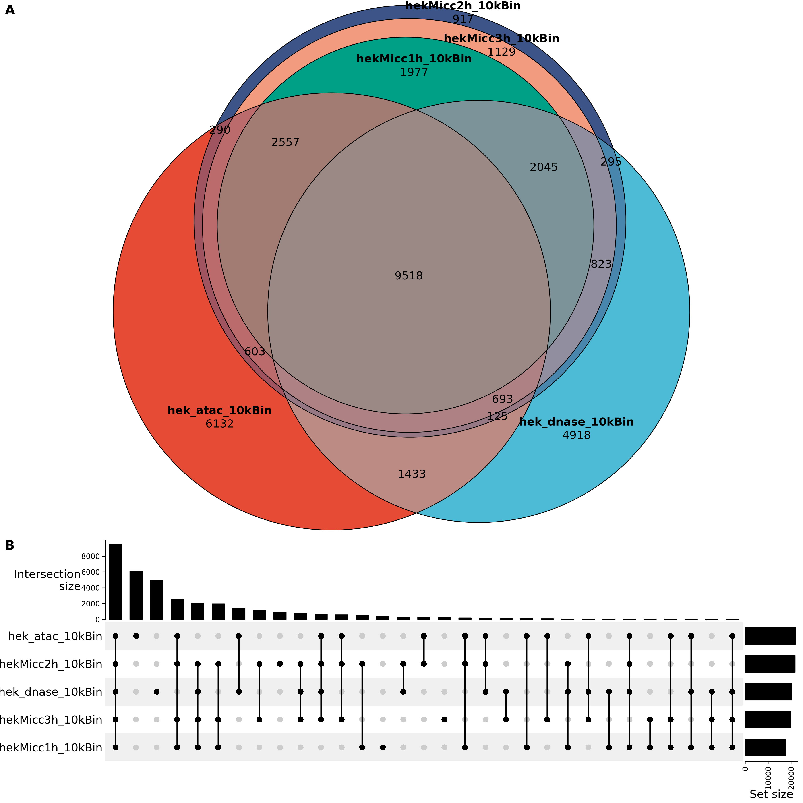

MICC-seq Accurately Maps Chromatin Accessible Peaks

Previous research has established Hia5's effectiveness in labeling accessible chromatin through single-molecule sequencing, showing a strong correlation (approximately 0.8) with DNase-seq results{Stergachis, 2020 #405}{Xie, 2024 #1613}. This correlation provides a solid foundation for MICC-seq's ability to accurately capture accessible regions using Hia5. To evaluate MICC-seq's effectiveness in enriching accessible chromatin interactions, we compared it to two well-established techniques: ATAC-seq{Buenrostro, 2013 #844} and DNase-seq{Song, 2010 #845}. 

We applied MICC-seq to 3T3 and HEK293T cells (10^5 cells each), generating 400M reads with approximately 90% valid pair ratio passing initial quality control (QC file in supplemental file 1). We then conducted a comprehensive analysis by normalizing each dataset to a standardized read count, aligning to the reference genome, and performing peak calling.

---
We first used the DpnI to digested the HEK293 genome to test if the background GAmTC level. We only detect very shallow depth of the reads, called only 10 peaks on whole genome. That matched the previous publication point out the mamallian DNA have very few m6A modification.

We then conducted optimization of the Hia5 labeling duration, a parameter essential for experimental sensitivity. Our analytical findings revealed that a 2-hour labeling period produced 30% enhanced signal intensity at transcription start sites when compared to a 1-hour protocol. 

This improvement in signal-to-noise ratio allowed us to achieve greater detection accuracy across the genome. This optimized methodology also successfully identified approximately 2,000 additional peaks with verified correspondence to ATAC-seq/DNase-seq results. Notably, extending the labeling duration to 3 hours did not demonstrate any significant improvement over the 2-hour protocol, suggesting we had reached optimal labeling efficiency.

---
We subsequently evaluated MICC-seq's capability to detect accessible chromatin regions. Our analysis revealed significant methodological alignment, with over 80% of MICC-seq peaks corresponding to either ATAC-seq or DNase-seq peaks. The non-overlapping peaks 30% exhibited non-GATC sequencing motif and others showed reduced p-values (0.1 vs 0.0001), indicating lower statistical significance in these regions. 

---
 Both transcription start sites (TSS) and CTCF binding sites, established accessible chromatin markers, demonstrated 4-6 fold signal enrichment in MICC-seq data. Additional analysis identified that MICC-seq produced a 3-4 fold enhancement for chromatin interactions at active transcription sites (RNApolII peaks) and regions featuring active chromatin epigenetic markers, particularly H3K4me1/3 and H3K27ac (Supplementary Figure 2). Quantitative assessment corroborated these findings, demonstrating a correlation coefficient of 0.61 between MICC-seq enrichment signals at TSS regions and ATAC-seq data, with a more pronounced correlation of 0.77 with DNase-seq data (Fig.1D). Importantly, experimental replicates showed an exceptionally high correlation of approximately 0.98, confirming strong methodological reproducibility (Fig.1D). Examination of representative genomic loci validated MICC-seq's capacity to accurately map accessible chromatin interactions, establishing its effectiveness as a robust analytical tool for accessible chromatin architecture studies.

  

