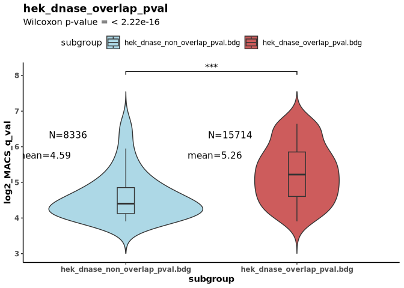

violin_2compare
================
<yemingxie@gmail.com>
Wed Aug 20 17:31:22 2025

``` r
knitr::opts_chunk$set(echo = TRUE)

library(ggplot2)
library(ggsci)
library(httpgd)
library(dplyr)
```

    ## 
    ## Attaching package: 'dplyr'

    ## The following objects are masked from 'package:stats':
    ## 
    ##     filter, lag

    ## The following objects are masked from 'package:base':
    ## 
    ##     intersect, setdiff, setequal, union

``` r
library(tidyr)
library(ggsignif)
npg_colors <- pal_npg()(10)

args = commandArgs(trailingOnly=TRUE)
file_path='/research/xieyeming1/proj_2025/MICC_paper/peak_hg19/peak_overlap_1d/overlap_metrics'

setwd('/research/xieyeming1/proj_2025/MICC_paper/genometube/MICC-seq/figs/section1/peak_overlap')
plot_title='hek_dnase_overlap_pval'
y_axis='log2_MACS_q_val'
in_file1='hek_dnase_non_overlap_pval.bdg'
in_file2='hek_dnase_overlap_pval.bdg'
in_file_1 <- read.table(paste0(file_path,'/',in_file1), sep="\t", header=F)
in_file_1$subgroup<-in_file1
in_file_2 <- read.table(paste0(file_path,'/',in_file2), sep="\t", header=F)
in_file_2$subgroup<-in_file2

# combine all data
all_data <- rbind(in_file_1, in_file_2)
all_data$feature_val <- ifelse(all_data$V4 > 0, log2(all_data$V4), NA)

wilcox_result <- wilcox.test(in_file_2$V4, in_file_1$V4, 
                           alternative = "two.sided")
head(all_data)
```

    ##     V1     V2     V3      V4                       subgroup feature_val
    ## 1 chr1  10422  10630 35.4739 hek_dnase_non_overlap_pval.bdg    5.148686
    ## 2 chr1 839067 841066 70.6036 hek_dnase_non_overlap_pval.bdg    6.141670
    ## 3 chr1 847332 850031 16.8202 hek_dnase_non_overlap_pval.bdg    4.072123
    ## 4 chr1 856484 856824 18.1079 hek_dnase_non_overlap_pval.bdg    4.178547
    ## 5 chr1 871120 871575 22.0596 hek_dnase_non_overlap_pval.bdg    4.463335
    ## 6 chr1 975919 976678 59.4686 hek_dnase_non_overlap_pval.bdg    5.894056

``` r
summ <- all_data %>%
  group_by(subgroup) %>%
  dplyr::summarize(n = n(), mean = round(mean(feature_val, na.rm = TRUE),2),
    max_val = round(max(feature_val, na.rm = TRUE),2),
    sd = sd(feature_val, na.rm = TRUE))
summ
```

    ## # A tibble: 2 × 5
    ##   subgroup                           n  mean max_val    sd
    ##   <chr>                          <int> <dbl>   <dbl> <dbl>
    ## 1 hek_dnase_non_overlap_pval.bdg  8336  4.59    6.64 0.641
    ## 2 hek_dnase_overlap_pval.bdg     15714  5.26    6.64 0.795

``` r
levels(factor(all_data$subgroup))
```

    ## [1] "hek_dnase_non_overlap_pval.bdg" "hek_dnase_overlap_pval.bdg"

``` r
p1<-ggplot(all_data, aes(x=subgroup, y=feature_val, fill=subgroup)) +
  geom_violin(trim=FALSE, bw=0.3, na.rm = TRUE) +
  geom_boxplot(width=0.1, outlier.shape = NA, na.rm = TRUE) +
  geom_text(aes(label = paste0('N=',n), y = max(max_val, na.rm = TRUE)), 
            data = summ, size=4, vjust = 2, hjust = 2) +
  geom_text(aes(label = paste0('mean=',mean), y = max(mean, na.rm = TRUE)), 
            data = summ, size=4, vjust = -2, hjust = 2) +
  scale_fill_manual(values=c("lightblue","indianred")) +
  theme_classic() +  geom_signif(comparisons = list(levels(factor(all_data$subgroup))), 
              test = "wilcox.test", map_signif_level = TRUE,
              y_position = max(all_data$feature_val, na.rm = TRUE) * 1.2) +
  labs(title = plot_title,
    subtitle = paste0("Wilcoxon p-value = ", format.pval(wilcox_result$p.value)),
    y = y_axis) +
  theme(axis.text = element_text(face='bold'),
    axis.title = element_text(face="bold"),plot.title = element_text(face="bold"),
    legend.position="top")
p1
```

<!-- -->

``` r
pdf(paste0(plot_title,'.pdf'))
print(p1)
dev.off()
```

    ## png 
    ##   2
