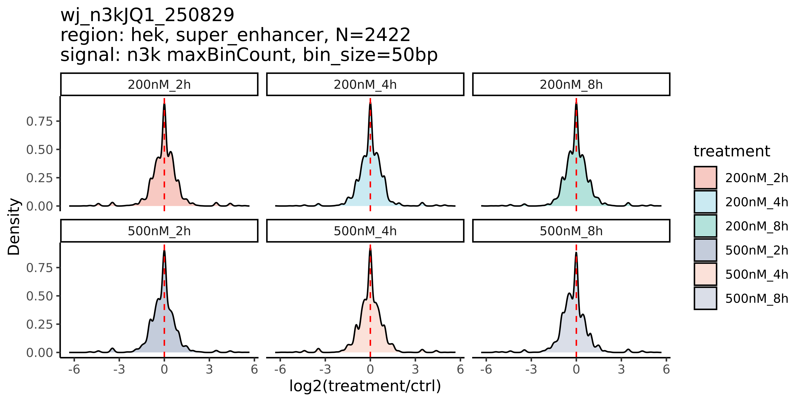

# Project Documentation

## Overview
This document provides comprehensive details for the project data located at `/zfswh7/solexa/homeward_A/homeward144A/Zebra/P25Z11900N0021_HUMhyyU/WHB5EXONPEP00101476/`. The project involves JQ-1 drug treatment experiments on 293 cells with N3K aldehyde-ketone labeling.

## Data Specifications

### Experimental Details
- **Experiment Type**: JQ-1 drug-treated 293 gradient experiment (using N3K aldehyde-ketone labeling)
- **Library Type**: **Non-MICC library** (explicitly specified)
- **Project ID**: P25Z11900N0021_HUMhyyU (Human internal R&D project)

### Barcode Treatment Conditions
| Barcode | Treatment Condition      |
|---------|--------------------------|
| 1       | 200nM/2h                 |
| 2       | 500nM/2h                 |
| 3       | 200nM/4h                 |
| 4       | 500nM/4h                 |
| 13      | 293 no-drug control (N3K labeled) |
| 14      | 200nM/8h                 |
| 15      | 500nM/8h                 |

### Data Statistics (L02)
- **Total Data Volume**: ~85.5G across 7 barcodes
- **Data Distribution**:

| Barcode | Data Size | Percentage |
|---------|-----------|------------|
| 1       | 12.42G    | 13.89%     |
| 2       | 12.44G    | 13.91%     |
| 3       | 11.04G    | 12.35%     |
| 4       | 13.14G    | 14.69%     |
| 13      | 12.72G    | 14.22%     |
| 14      | 12.92G    | 14.44%     |
| 15      | 10.91G    | 12.20%     |

**Data Balance**: All barcodes show uniform data distribution (12.20%-14.69%), meeting gradient experiment design requirements.

## Quality Control Metrics

### QC Metrics Summary

| Sample ID | Raw Reads    | Clean Reads   | Aligned Reads  | Deduplicated Reads | Peak Number |
|-----------|--------------|---------------|----------------|-------------------|-------------|
| 13        | 6.3595e+07   | 6.3595e+07    | 6.19175e+07    | 1.07171e+07       | 637         |
| 14        | 6.45852e+07  | 6.45852e+07   | 6.25174e+07    | 1.07652e+07       | 542         |
| 15        | 5.45452e+07  | 5.45452e+07   | 5.29297e+07    | 9.33495e+06       | 383         |
| 1         | 6.21093e+07  | 6.21093e+07   | 6.00582e+07    | 1.1061e+07        | 721         |
| 2         | 6.218e+07    | 6.218e+07     | 6.01557e+07    | 1.07839e+07       | 664         |
| 3         | 5.52065e+07  | 5.52065e+07   | 5.31748e+07    | 1.04855e+07       | 651         |
| 4         | 6.56848e+07  | 6.56848e+07   | 6.35434e+07    | 1.0175e+07        | 607         |

## Visualizations

### Figure 1
  
*Figure 1: micc_SE_n3k_1*

### Figure 2
  
*Figure 2: micc_SE_n3k_2*

### Figure 3
  
*Figure 3: wj_n3kJQ1_250829_n3k_maxBinCount_promoter_density*

### Figure 4
  
*Figure 4: wj_n3kJQ1_250829_n3k_maxBinCount_super_enhancer_density*

## Additional Notes
- **Contact**: Wang Juan (wangjn@bgi.com)
- **Analysis Requirements**: Further discussion needed regarding analysis content (literature references available)
- **Consultation Required**: Need to consult with "师傅" (master/mentor) to confirm specific analysis direction

---
*Document generated on 2025-09-05 15:26:43*