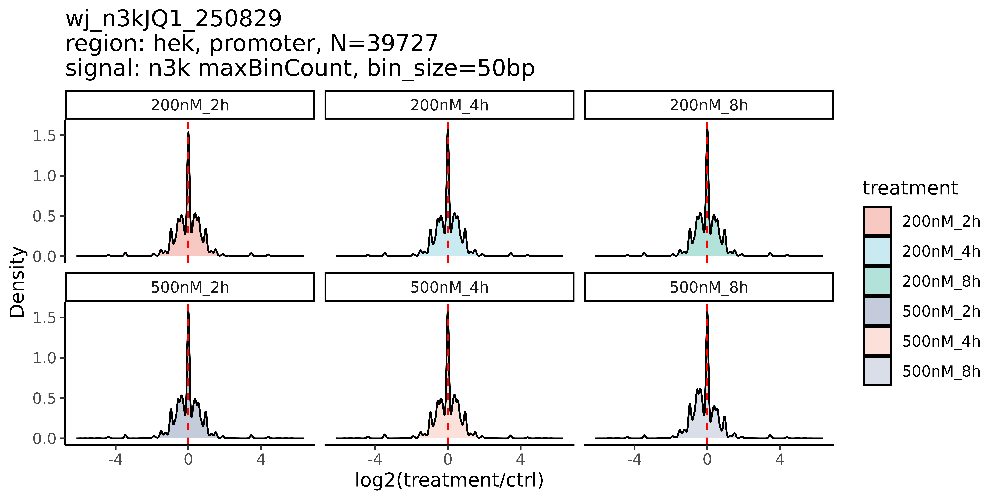
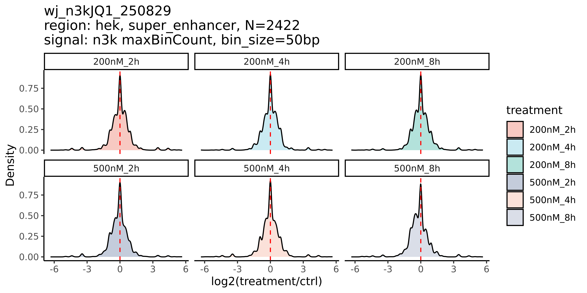

# 生物信息学项目文档

## 项目概述

本项目针对JQ-1药物处理的293细胞梯度实验数据进行分析，实验采用N3K醛酮标记技术，明确为非MICC文库类型。数据来源于人内部研发项目（编号：P25Z11900N0021_HUMhyyU），包含7个不同处理条件的barcode样本。

---

## 数据信息

### 数据路径
- **完整数据存储路径**：  
  `/zfswh7/solexa/homeward_A/homeward144A/Zebra/P25Z11900N0021_HUMhyyU/WHB5EXONPEP00101476/`

### 实验设计
- **实验类型**：JQ-1药物处理的293梯度实验（N3K醛酮标记）
- **文库类型**：非MICC文库

#### Barcode处理条件详情
| Barcode编号 | 处理条件              |
|-------------|-----------------------|
| 1           | 200nM JQ-1，处理2小时  |
| 2           | 500nM JQ-1，处理2小时  |
| 3           | 200nM JQ-1，处理4小时  |
| 4           | 500nM JQ-1，处理4小时  |
| 13          | 293细胞无用药对照（N3K标记） |
| 14          | 200nM JQ-1，处理8小时  |
| 15          | 500nM JQ-1，处理8小时  |

### 数据统计
- **总数据量**：约85.5G
- **数据分布均匀性**：各barcode数据量占比在12.20%-14.69%之间，分布均匀，符合梯度实验设计要求

| Barcode | 数据量(G) | 占比(%) |
|---------|-----------|---------|
| 1       | 12.42     | 13.89   |
| 2       | 12.44     | 13.91   |
| 3       | 11.04     | 12.35   |
| 4       | 13.14     | 14.69   |
| 13      | 12.72     | 14.22   |
| 14      | 12.92     | 14.44   |
| 15      | 10.91     | 12.20   |

---

## 质量控制指标

### 测序数据统计表

| 样本ID | 原始读数 (raw_reads) | 质控后读数 (clean_reads) | 比对读数 (aligned_reads) | 去重后读数 (dedup_reads) | 峰值数量 (peak_num) |
|--------|----------------------|--------------------------|--------------------------|--------------------------|---------------------|
| 13     | 6.3595e+07           | 6.3595e+07               | 6.19175e+07              | 1.07171e+07              | 637                 |
| 14     | 6.45852e+07          | 6.45852e+07              | 6.25174e+07              | 1.07652e+07              | 542                 |
| 15     | 5.45452e+07          | 5.45452e+07              | 5.29297e+07              | 9.33495e+06              | 383                 |
| 1      | 6.21093e+07          | 6.21093e+07              | 6.00582e+07              | 1.1061e+07               | 721                 |
| 2      | 6.218e+07            | 6.218e+07                | 6.01557e+07              | 1.07839e+07              | 664                 |
| 3      | 5.52065e+07          | 5.52065e+07              | 5.31748e+07              | 1.04855e+07              | 651                 |
| 4      | 6.56848e+07          | 6.56848e+07              | 6.35434e+07              | 1.0175e+07               | 607                 |

---

## 可视化结果

  
**图1：MICC单端N3K标记数据可视化**

  
**图2：启动子区域最大bin计数密度分布**

  
**图3：超级增强子区域最大bin计数密度分布**

---

## 分析脚本方法描述

### align_single.sh
**功能**：执行单样本ChIP-seq或ATAC-seq完整分析流程

#### 分析方法：
1. **质量控制与接头修剪**
   - 使用`fastp`进行质量控制、接头修剪，生成HTML/JSON格式QC报告
   - 处理双端测序reads（R1和R2），支持多线程

2. **序列比对**
   - 使用`bowtie2`以敏感端到端模式将质控后reads比对至hg19参考基因组
   - 使用`samtools`将SAM转换为BAM格式，排序并建立索引

3. **重复序列去除**
   - 使用`picard MarkDuplicates`从排序后的BAM文件中去除PCR重复
   - 生成重复序列度量用于质量评估

4. **峰值识别**
   - 使用`MACS2 callpeak`基于BAM输入识别富集区域
   - 保留所有重复序列进行分析

5. **下采样与BigWig生成**
   - 随机下采样至1800万reads以实现均匀覆盖度比较
   - 使用`bedGraphToBigWig`将BAM转换为BED格式并生成BigWig覆盖度轨迹

6. **质量指标收集**
   - 计算关键QC指标：原始读数、质控后读数、比对读数、去重后读数和峰值数量
   - 以制表符分隔格式存储指标用于下游分析

7. **特征富集分析**
   - 创建全基因组范围内的基因组窗口（100bp bins）
   - 使用`bedtools map`将覆盖度映射至超级增强子和启动子区域
   - 通过计算最大覆盖度值量化调控元件的富集程度

**输入**：单样本双端FASTQ文件  
**输出**：比对BAM文件、峰值识别结果、覆盖度轨迹、QC指标、特征富集谱  
**参考基因组**：hg19（包含线粒体序列）

---

### parallel.sh
**功能**：多样本并行处理流程

#### 并行处理方法：
1. **样本识别**：从原始数据文件夹目录路径中提取样本ID，排除"fetch"目录
2. **并行执行**：使用GNU parallel进行并发处理，可配置任务数量（默认：10个并行任务）
3. **比对处理**：对每个样本执行`align_single.sh`脚本进行序列比对
4. **QC指标收集**：（注释状态）将各样本文件的质控指标汇总至统计表

**关键特性**：
- 基于目录结构的自动样本发现
- 可配置的并行处理以优化资源利用
- 模块化设计，每个样本使用独立的比对脚本
- 适用于大规模样本集的可扩展性设计
- 包含时间戳记录用于过程监控

---

### track.sh
**功能**：生成TAD（拓扑关联域）图谱

#### 方法描述：
1. **工具**：`hicPlotTADs`（来自HiCExplorer包）
2. **输入**：
   - 轨迹配置文件：`tracks.ini.n3k_250904`
   - 基因组区域：`chr7:149000000-151000000`（染色体7上2Mb区域）
3. **输出**：
   - 图像文件：`micc_SE_n3k_1.png`（TAD及相关数据轨迹可视化）
4. **目的**：使用预处理后的Hi-C数据和配置文件中定义的附加轨迹，可视化指定基因组区域内的染色质结构，特别是TAD边界和相互作用

**注意**：脚本中包含冗余的路径赋值（第二次赋值覆盖第一次），仅第二次路径用于执行

---

### wj_n3kJQ1_250829_mapMaxBin.R
**功能**：基因组信号强度比较分析

#### 分析方法：
1. **数据加载与预处理**
   - 加载包含各样本分箱基因组信号数据（maxBinCount）的bedGraph文件（`*.bdg`）
   - 将每个样本映射至相应的处理条件（如`200nM_2h`、`500nM_4h`、`n3k_ctrl`）
   - 将数据组合成长格式表格，包含列：`peak_id`（基因组坐标）、`treatment`、`maxBinCount_n3k`

2. **标准化处理**
   - 将数据转换为宽格式（每处理条件一列）
   - 使用以下公式通过对照（`n3k_ctrl`）列标准化各处理列：
     \[
     \text{标准化值} = \frac{\text{处理计数} + 0.1}{\text{对照计数} + 0.1}
     \]
   - 转换回长格式用于可视化

3. **可视化**
   - **密度图**：针对每个基因组区域（超级增强子和启动子），绘制各处理条件下log₂倍变化（处理/对照）的分布
   - 包含参考线（log₂FC = 0处的垂直虚线）
   - 使用分面将各处理条件的图表分开
   - 保存为高分辨率PNG文件

4. **分析的基因组区域**
   - **超级增强子**：使用匹配`*.SE.bdg`的文件进行分析
   - **启动子**：使用匹配`*.promoter.bdg`的文件进行分析

5. **工具与库**
   - 使用`data.table`进行高效数据处理，`ggplot2`进行绘图，`dplyr`/`reshape2`进行数据操作
   - 应用`ggsci`的`npg`调色板确保颜色一致性

**关键输出**：
- 显示各处理条件相对于对照的标准化maxBinCount信号（log₂FC）分布的密度图
- 每个图表包含样本量（N）以及基因组区域和分箱大小的详细信息

**分析目的**：比较不同药物处理（浓度和持续时间）对特定区域基因组信号强度的影响，相对于对照条件

---

## 备注
- **项目联系人**：王娟（wangjn@bgi.com）
- **进一步分析**：需进一步讨论分析内容（可提供文献参考），并咨询"师傅"确认具体分析方向
- **文档生成时间**：2025-09-05 17:02:34