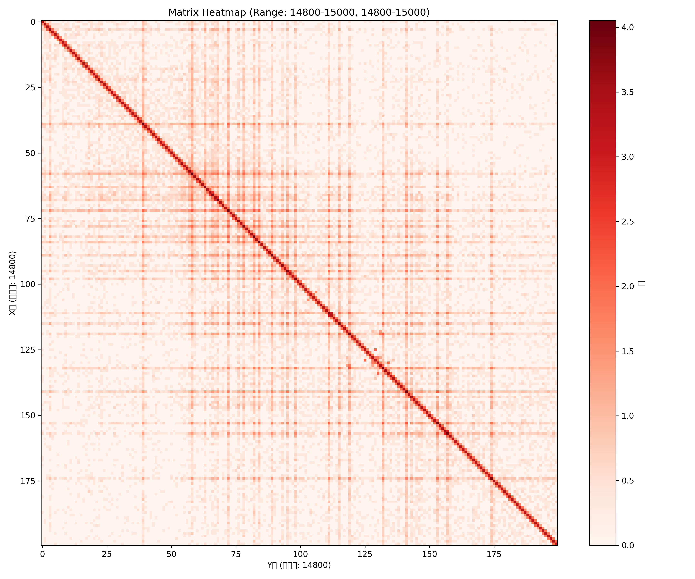
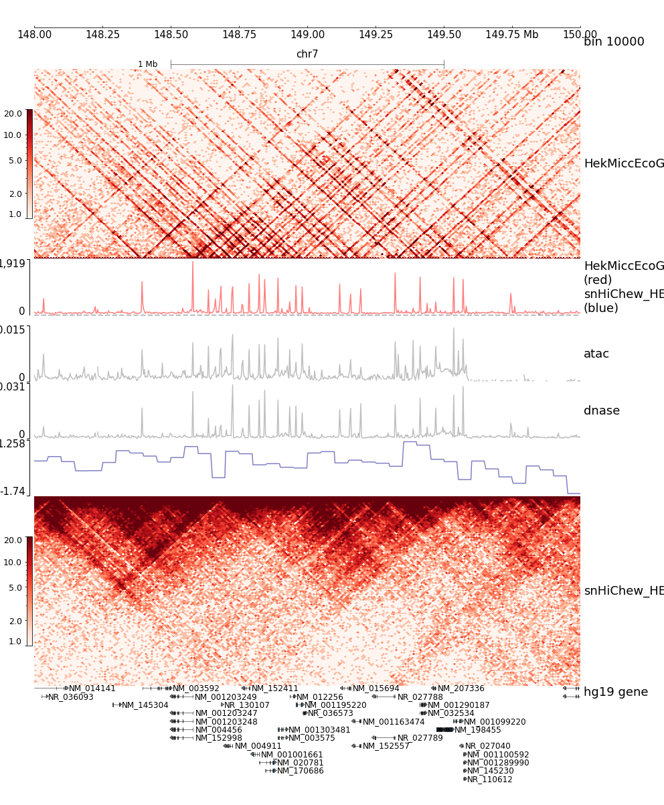
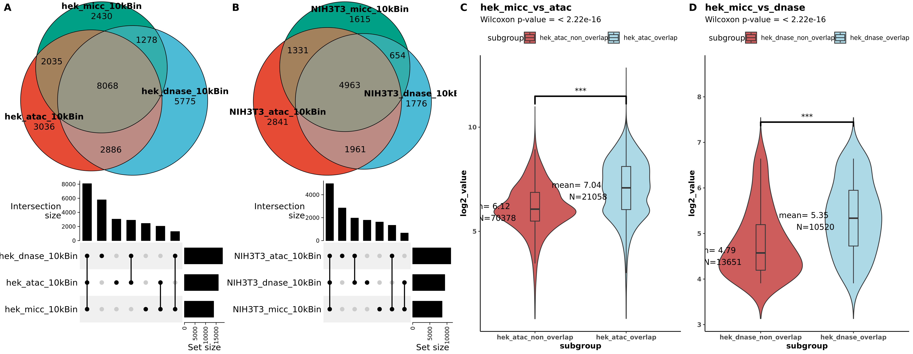

## Predict MICC from ATAC

### Dataset access
#### HEK293/NIH3T3 ATAC-seq
[HEK293_atac.narrowPeak](hek293_atac_medium_depth_peaks.narrowPeak)  
[HEK293_atac.bw](https://www.ncbi.nlm.nih.gov/geo/query/acc.cgi?acc=GSM2902628) 
[NIH3T3_atac.narrowPeak](../../db/peaks/NIH3T3_atac.narrowpeak)  
[NIH3T3_atac.bw](https://www.ncbi.nlm.nih.gov/geo/query/acc.cgi?acc=GSM2796909)

#### HEK293/NIH3T3 MICC-seq
[HEK293_micc.parquet](files/MICC_HEKwt_hg19_10000.parquet)  
[NIH3T3_micc.parquet](files/MICC_NIH3T3_mm10_10000.parquet)

---
### Dataset description
The .parquet files contain chromatin interaction data converted from Juicer's merged_nodups.txt format. 
 Each record represents a non-duplicate valid pair, with pos1 and pos2 indicating genomic loci (binned at 10kb resolution).

| chr |  pos1 |  pos2 | count |
|-----|-------|-------|-------|
|   1 |  2053 | 11780 |     1 |
|   1 |  8025 |  8365 |     1 |
|   1 | 22452 | 24178 |     1 |

 
Quick check of .parquet file: 
To generate .mtx file from .parquet file, run: python scripts/micc_mtx.py  
To generate ROI heatmap from .mtx file, run: python scripts/mtx_heatmap.py  

---
### Reference
https://journals.plos.org/ploscompbiol/article?id=10.1371/journal.pcbi.1012136
这篇用扩散模型，用HFFc6细胞的Hi-C (x) 和 Micro-C (y) 数据做训练，然后在6个不同细胞中验证（输入hic，输出microC）

https://www.science.org/doi/10.1126/sciadv.adr8265
这篇用扩散模型，用12878的dnase seq和单细胞hic数据做训练，然后输入IMR90的dnase seq，可以预测IMR90的hic

---
### Rationale
MICC 1D signal shows high correlation with ATAC-seq, which suggests that ATAC-seq can be used to predict MICC. 

