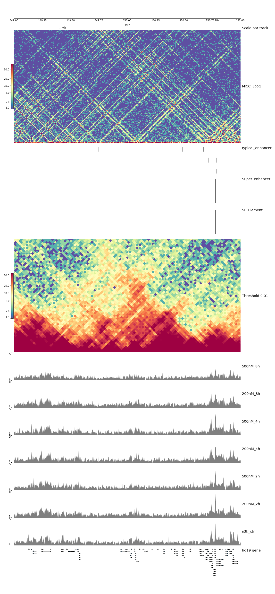
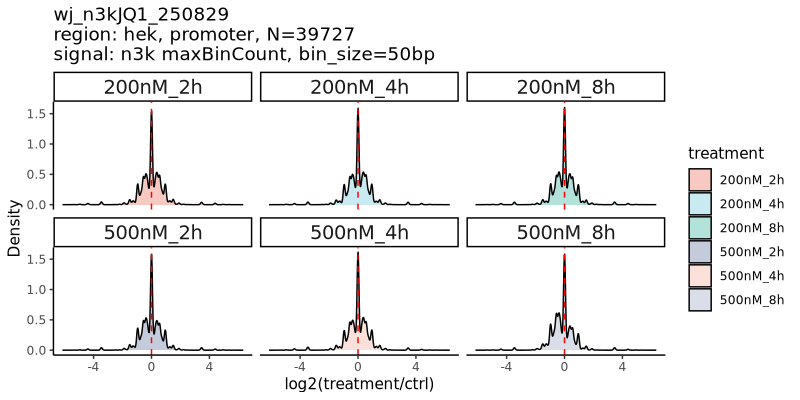
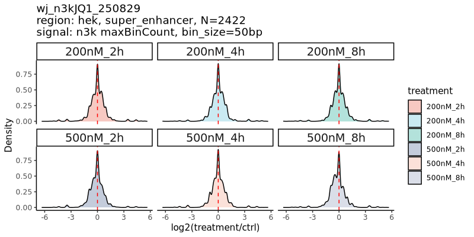

# 生物信息学分析文档

## 项目概述

本项目针对JQ-1药物处理的293细胞梯度实验数据进行分析，实验使用N3K醛酮标记，属于非MICC文库类型。分析涵盖了从原始数据处理到高级基因组特征分析的全流程。

## 数据信息

### 样本信息
| Barcode | 处理条件        | 样本标识    |
|---------|-----------------|-------------|
| 1       | 200nM/2h        | 200nM_2h    |
| 2       | 500nM/2h        | 500nM_2h    |
| 3       | 200nM/4h        | 200nM_4h    |
| 4       | 500nM/4h        | 500nM_4h    |
| 13      | 293无用药对照    | n3k_ctrl    |
| 14      | 200nM/8h        | 200nM_8h    |
| 15      | 500nM/8h        | 500nM_8h    |

### 数据统计
- **项目编号**: P25Z11900N0021_HUMhyyU
- **总数据量**: 约85.5G
- **数据分布**: 各barcode数据量均匀（12.20%-14.69%）

## 质量评估指标

| 样本ID | 原始读数   | 清洁读数   | 比对读数   | 去重后读数 | 峰数量 |
|--------|------------|------------|------------|------------|--------|
| 13     | 63,595,019 | 63,594,996 | 61,917,541 | 10,717,145 | 637    |
| 14     | 64,585,197 | 64,585,174 | 62,517,373 | 10,765,170 | 542    |
| 15     | 54,545,214 | 54,545,194 | 52,929,657 | 9,334,947  | 383    |
| 1      | 62,109,287 | 62,109,264 | 60,058,194 | 11,060,981 | 721    |
| 2      | 62,180,032 | 62,180,004 | 60,155,726 | 10,783,905 | 664    |
| 3      | 55,206,505 | 55,206,482 | 53,174,777 | 10,485,462 | 651    |
| 4      | 65,684,842 | 65,684,807 | 63,543,428 | 10,175,043 | 607    |

## 可视化结果

*图1: TAD结构可视化 - 显示7号染色体149,000,000-151,000,000 bp区域的拓扑关联域*

*图2: 启动子区域信号密度分布 - 各处理条件相对于对照的log2倍数变化*

*图3: 超级增强子区域信号密度分布 - 各处理条件相对于对照的log2倍数变化*

## 分析方法总结

### 分析流程概述

- **质量控制与接头修剪**
  - 使用`fastp`进行质量控制、接头修剪并生成HTML/JSON格式的QC报告
  - 处理双端FASTQ文件（R1和R2）

- **序列比对**
  - 使用`bowtie2`进行敏感的全长比对
  - 将修剪后的reads比对到hg19参考基因组
  - 使用`samtools`将SAM格式转换为BAM格式

- **重复序列去除**
  - 使用`picard MarkDuplicates`去除PCR重复
  - 生成重复率相关指标

- **峰检测**
  - 使用`MACS2`识别可及染色质区域（peaks）
  - 保留所有重复用于峰检测

- **覆盖度分析**
  - 使用`bedtools`将BAM格式转换为BED格式
  - 降采样至1800万reads以确保覆盖度一致性
  - 生成bedGraph和BigWig覆盖度文件

- **质量指标收集**
  - 提取多种QC指标：原始读数、清洁读数、比对读数、去重后读数、峰数量
  - 从外部文件映射样本ID到样本标签

- **基因组特征分析**
  - 创建基因组窗口（100bp bins）并计算覆盖度
  - 使用`bedtools map`将覆盖度映射到超级增强子和启动子区域

- **并行处理**
  - 使用GNU parallel同时处理多个样本
  - 提取样本ID并执行并行比对作业
  - 汇总所有样本的QC指标

- **TAD可视化**
  - 使用`hicPlotTADs`工具生成特定基因组区域的TAD图谱
  - 可视化7号染色体149,000,000-151,000,000 bp区域的染色质结构

- **比较基因组分析**
  - 从.bdg文件加载基因组信号数据
  - 将处理条件信号相对于对照进行归一化（添加0.1伪计数）
  - 计算log2倍数变化并生成密度分布图
  - 分别分析超级增强子和启动子区域

*文档生成时间: 2025-09-05 18:19:00*